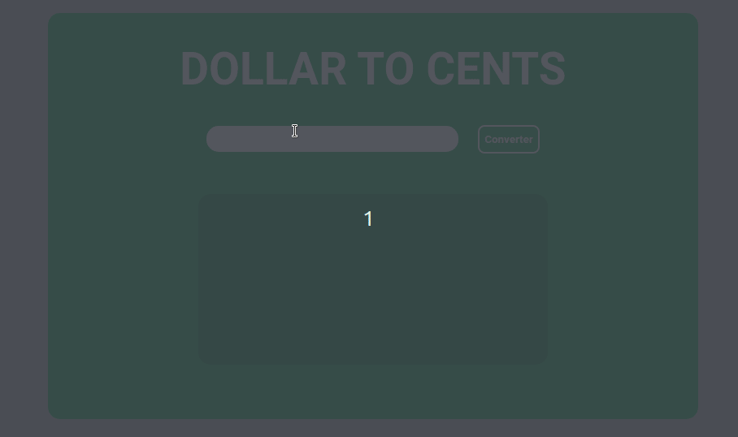

<h1 align="center">Dollar2Cents 💵</h1>

<h1 align="center">
  
</h1>

Converte dolars para cents

---

## Funcionalidades

- [x] O usuário pode inserir um valor em dólar.
- [x] O usuário pode ver o total de centavos do valor do dólar convertido.
- [x] O usuário pode ver quantos pennies, nickels, quarters e dimes do total de cents.

## Autor

:bust_in_silhouette: Gabriel Henrique

- Twitter: [@GabrewHenrique](https://twitter.com/GabrewHenrique)
- Github: [@Gabriek0](https://github.com/Gabriek0)
- LinkedIn: [gabriel-henrique](https://www.linkedin.com/in/gabriel-henrique-664bb219a/)

---